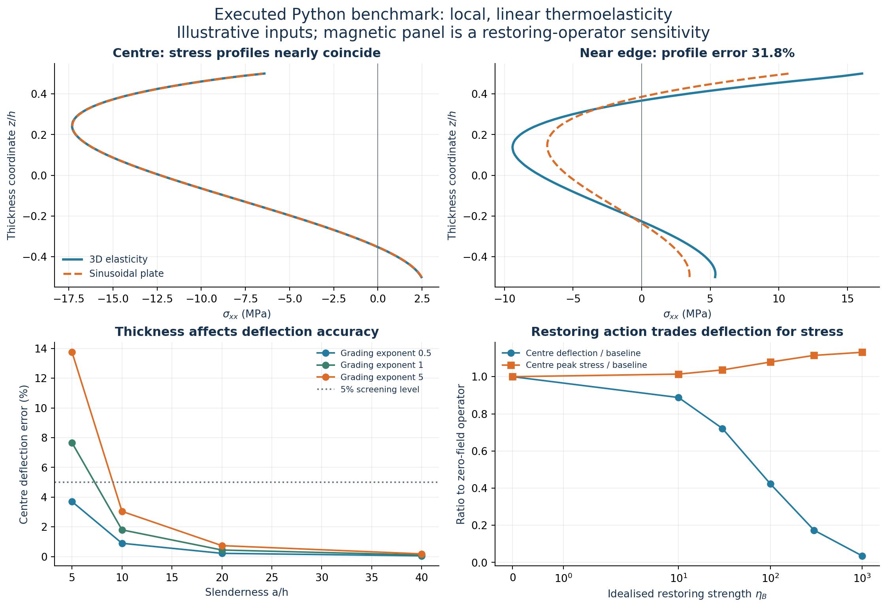

# Results of the executed Python benchmark

Run: 12 September 2026. **70 distinct model comparisons, 76 labelled result rows, seven passed numerical checks, and seven exported figures.** Full sweep runtime was 173.7 seconds in this environment, excluding figure generation.

These are results for the explicit local linear benchmark in `README.md`. The original uploaded proposal was unavailable, so they are **not yet results for its exact formulation**. Material mixture, porosity law, support interpretation and the magnetic-restoring operator are selected assumptions. No Bayesian inference, finite nonlocality, nonlinear response or stability calculation was performed.

**What the four questions show at this stage**

| Question | Executed analysis | Finding and qualification |
|---|---|---|
| RQ1: How accurate is the sinusoidal approximation? | Compare five-field sinusoidal plate theory with 3D elasticity, including thickness stress profiles | Baseline centre deflection error is 1.80%. Near-edge normal-stress profile error is about 32%, despite close agreement at the centre. This concerns the particular plate kinematics and supports used here. |
| RQ2: Where does the approximation become inadequate? | 24 cases spanning $a/h=5,10,20,40$, grading exponents 0.5, 1, 5, and mean porosities 0 and 0.2 | Deflection errors range from 0.05% to 13.74%. Near-edge stress errors are roughly 17–45% across the sampled cases. A single “thin enough” rule cannot certify both quantities on these paths. |
| RQ3: Does magnetic loading improve every response? | Add the same assumed positive transverse restoring energy to both models and sweep its strength | At $\eta_B=1000$, 3D centre displacement is 96.43% smaller, but centre-path peak absolute normal stress is 13.12% larger. This is conditional evidence about the assumed operator, not a calibrated magnetic-field prediction. Stability is unanswered. |
| RQ4: Are conclusions robust to assumptions? | 12 individual parameter perturbations, three equal-mean pore profiles, a clamped control, and 16 joint bounded samples | The sampled centre stress spans 12.40–22.38 MPa. Pore distribution and restraint matter. These are observed design-sample ranges, not probability intervals or exhaustive bounds. Finite-nonlocal robustness remains unanswered. |

**Baseline values**

Square plate, $a/h=10$, grading exponent 1, mean porosity 0.10, top temperature rise 20 K, bottom rise 0 K, SS diaphragms, no mechanical pressure and no restoring operator.

| Response | 3D elasticity | Sinusoidal plate |
|---|---:|---:|
| Centre displacement $w/a$ | $5.79344\times10^{-5}$ | $5.89773\times10^{-5}$ |
| Centre displacement $w/h$ | $5.79344\times10^{-4}$ | $5.89773\times10^{-4}$ |
| Centre-path peak $|\sigma_{xx}|$ | 17.313 MPa | 17.293 MPa |
| Near-edge-path peak $|\sigma_{xx}|$ | 16.062 MPa | 10.740 MPa |

The normal-stress comparison is an integrated relative error across thickness, not the difference between the two peak values. The near-edge path is at $x=h/2$, $y=b/2$. Peak values here are path peaks, not maxima over the entire plate or failure criteria.

The centre normal-stress profile difference is only 0.16% at the main resolution, but the 3D centre stress itself changes by about 0.31% under Fourier refinement. It would therefore be inappropriate to claim demonstrated accuracy to a fraction of a percent from that value. The defensible observation is that centre stress agreement is much closer than near-edge agreement.

**Applicability is quantity- and location-dependent**

| Slenderness $a/h$ | Sampled centre-deflection error range |
|---:|---:|
| 5 | 3.70–13.74% |
| 10 | 0.90–3.04% |
| 20 | 0.22–0.74% |
| 40 | 0.05–0.18% |

All cases at $a/h\geq10$ meet the illustrative 5% centre-deflection screen. None of the 24 cases meet the **joint** screen that also requires less than 10% near-edge normal-stress error. The near-edge location stays at a distance $h/2$ from the support; it moves closer to the edge as the plate becomes thinner. This result does not imply that thin-plate predictions fail throughout the interior.

The two porosity rows in the error map are nearly identical for a structural reason. Under the selected uniform-porosity law, changing mean porosity multiplies the entire stiffness profile by one constant and the conductivity profile by another. For prescribed face temperatures and thermal-only loading, the latter factor cancels from the temperature solution, and the former changes stress scale without changing displacement. This is a consequence of the assumed laws, **not a general conclusion that porosity has no effect on thermal deformation**.

**Numerical resolution and verification**

The independent solid/modal pressure check differed by 0.056% in centre displacement and 0.272% in the centre normal-stress profile. Both mechanical solvers approached the analytical thin-plate pressure solution within 0.052%. The affine patch and free-expansion checks passed at roundoff levels; steady heat flux varied by less than $9\times10^{-8}$ relatively. See `tables/verification.csv` for exact values and tolerances.

For the thermal baseline, increasing the Fourier resolution from 121 to 241 odd harmonics per axis changes the 3D centre displacement by 0.000085%, the centre normal-stress profile by 0.315%, and the near-edge profile by 0.727%. The plate/3D near-edge discrepancy changes from 31.79% to 31.50%, so the large discrepancy persists under refinement. Increasing the thickness mesh from 32 to 64 quadratic elements changes the centre and near-edge profiles by 0.019% and 0.113%, respectively.

Thin-plate edge profiles need more harmonics. In the refined $a/h=40$, grading-0.5, porosity-0.2 case, the near-edge error changes from 41.54% to 44.89%. Accordingly the maps identify broad failures of the selected 10% screen; their individual edge-error percentages are not all resolved to one percentage point.

Thermal shear at the quarter-span path is very small and sensitive to numerical truncation. Its relative percentage error is not used to classify applicability. Absolute shear differences and normal-stress-scaled differences are retained in the tables. The pressure diagnostic gives a more usable shear comparison, but its loading differs from the main thermal problem.

These are numerical verification and convergence results. No experimental validation or exact reproduction of a published FGM benchmark is claimed.

**Robustness findings**

At the same mean porosity of 0.10, concentrating pores around the midplane increases baseline 3D deflection by 10.98% and centre-path peak stress by 12.95%. Concentrating them near the faces decreases deflection by 11.84% and centre-path peak stress by 1.95%. The exact values depend on the selected effective-property laws.

The refined fully clamped control has a centre-path peak stress of 40.14 MPa, compared with 17.31 MPa for the SS baseline. Its centre displacement is very small, while the five-field plate predicts effectively zero transverse motion for this uniform in-plane thermal load. The 3D model admits thickness expansion and local edge deformation. Relative displacement percentages in this nearly motionless control should not be used as a general plate-accuracy measure; its displacement is also less well converged than its centre stress.

The 16 joint samples give $|w|/h$ between 0.000486 and 0.000651, and centre-path peak $|\sigma_{xx}|$ between 12.40 and 22.38 MPa. No probabilities attach to these ranges. One-at-a-time results identify thermal expansion and grading as displacement-sensitive assumptions; modulus, expansion, grading and mean porosity affect stress under the assumed laws.

**Implication for the thesis**

A useful direction to investigate is a response-specific assessment of sinusoidal plate theory: centre deflection, centre thermal stress, support-region stress and sensitivity to restraint need separate acceptance criteria. The executed restoring experiment also shows why reducing displacement should not be equated with reducing every stress measure.

These observations identify a candidate focus; they do not establish a new research gap. The original equations and a current literature comparison are still needed to determine whether the proposed contribution is already covered, whether normal stretching is included in the thesis model, and how finite nonlocality and the actual magnetic law alter the conclusions.

Reattaching the proposal and supporting PDFs will allow replacement of the selected assumptions with the exact formulation. The code and comparisons are ready to serve as a verification scaffold for that step.
